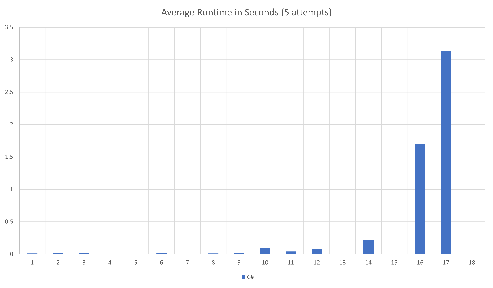

# Advent of Code 2023
Solutions to [Advent of Code 2023](https://adventofcode.com/2023)

Yeah, I never did get around to doing 2022 (yet), but I'm tinkering with these again in 2023. .NET and C# have come a
long way, and though most of the big changes won't impact these solutions at all, I may look to force some of the newer
syntaxes in for the experience.

In case I end up solving over time and in multiple languages, I'll track which solutions I've done, in the chart below.

## Progress

|      |1|2|3|4|5|6|7|8|9|10|11|12|13|14|15|16|17|18|19|20|21|22|23|24|25|
|------|-|-|-|-|-|-|-|-|-|--|--|--|--|--|--|--|--|--|--|--|--|--|--|--|--|
|**C#**|🌟|🌟|🌟|🌟|🌟|🌟|🌟|🌟|🌟|🌟|🌟|⭐|🌟|🌟|🌟|🌟|🌟|🌟|  |  |  |  |  |  |  |

⭐ - First star completed\
🌟 - Both stars completed

## Results
I've added `output.txt` as a reference for my answers (for convenient checking while refactoring) and runtimes of my solutions.

C# - [output.txt](csharp/output.txt)



### Updating results
To generate new output txt file
```
dotnet run --project .\AdventOfCode2023\AdventOfCode2023.csproj  --configuration=Release > output.txt
```

To update chart
1. Generate new runtimes:
```
dotnet run --project .\AdventOfCode2023\AdventOfCode2023.csproj --configuration=AverageRuntimes
```
2. Copy the last lines (after the "------") into the Excel file
3. Save chart to image as "RuntimesChart.png"

I know! It's a manual process. That bugs me too. I'm open to suggestions, but I do want to keep it flexible for multiple languages and edge cases.

## Environment
* Visual Studio 2022
* [.NET 8](https://dotnet.microsoft.com/download/dotnet/8.0) / C# 12

## Links
* [Advent of Code](https://adventofcode.com)
* [2021 Solutions](https://github.com/efrees/AdventOfCode2023)