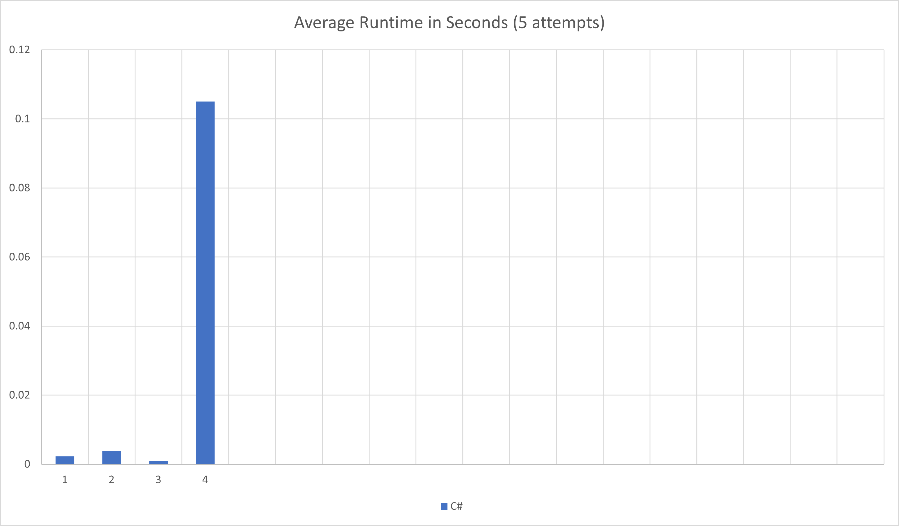

# Advent of Code 2025
Solutions to [Advent of Code 2025](https://adventofcode.com/2025)

My shortened time for puzzles was met this year with a shortened schedule of 12 problems, so of course I'm going to give them a go.

As usual, I'll probably keep solving these over time, so I'll track which solutions I've done, in the chart below.

## Progress

|      |1|2|3|4|5|6|7|8|9|10|11|12|
|------|-|-|-|-|-|-|-|-|-|--|--|--|
|**C#**|🌟|🌟|🌟|🌟|🌟| | | | |  |  |  |

⭐ - First star completed\
🌟 - Both stars completed

## Results
I've added `output.txt` as a reference for my answers (for convenient checking while refactoring) and runtimes of my solutions.

C# - [output.txt](csharp/output.txt)



### Updating results
To generate new output txt file
```
dotnet run --project .\AdventOfCode2025\AdventOfCode2025.csproj  --configuration=Release > output.txt
```

To update chart
1. Generate new runtimes:
```
dotnet run --project .\AdventOfCode2025\AdventOfCode2025.csproj --configuration=AverageRuntimes
```
2. Copy the last lines (after the "------") into the Excel file
3. Save chart to image as "RuntimesChart.png"

I know! It's a manual process. That bugs me too. I'm open to suggestions, but I do want to keep it flexible for multiple languages and edge cases.

## Environment
* nvim / Visual Studio 2026
* [.NET 10](https://dotnet.microsoft.com/download/dotnet/10.0) / C# 12

## Links
* [Advent of Code](https://adventofcode.com)
* [2024 Solutions](../2024/)
