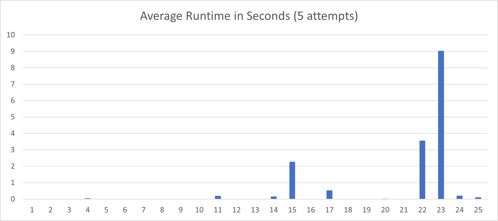

# Advent of Code 2020
Solutions to [Advent of Code 2020](https://adventofcode.com/2020)

Once again, I'm participating in Advent of Code for practice and fun. Here you'll find solutions clever and comical,
flawed and forgettable. Some done in a rush in the middle of the night, and (eventually) some done months later and
carefully refined for performance or simply to try out a new language feature.

This year, like the last two, I'm primarily practicing Rust, which (regrettably) I have rarely used in the other
eleven months of the year. I expect I may solve some in other languages or be forced, in vintage AoC fashion, to solve
by hand in a text editor.

## Progress

|      |1|2|3|4|5|6|7|8|9|10|11|12|13|14|15|16|17|18|19|20|21|22|23|24|25|
|------|-|-|-|-|-|-|-|-|-|--|--|--|--|--|--|--|--|--|--|--|--|--|--|--|--|
|**Rust**|🌟|🌟|🌟|🌟|🌟|🌟|🌟|🌟|🌟|🌟|🌟|🌟|🌟|🌟|🌟|🌟|🌟|🌟|🌟|⭐|🌟|🕚|☆|☆|☆|

⭐ - First star completed\
🌟 - Both stars completed

## Results
I've added `output.txt` as a reference for my answers (for convenient checking while refactoring) and runtimes of my solutions.

Rust - [output.txt](rust/output.txt)

## Environment
* VS Code
  * [rust-analyzer](https://marketplace.visualstudio.com/items?itemName=matklad.rust-analyzer)
  * [CodeLLDB](https://marketplace.visualstudio.com/items?itemName=vadimcn.vscode-lldb)

## Links
* [Advent of Code](https://adventofcode.com)
* [Rust](https://www.rust-lang.org)